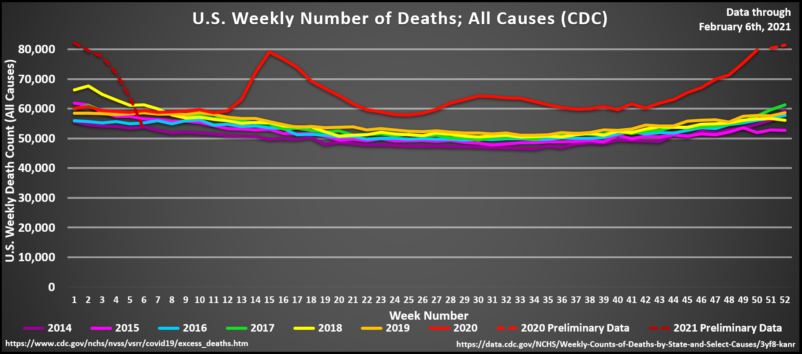
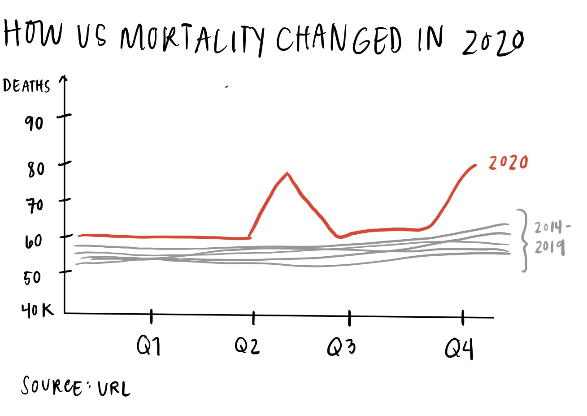

# Homework #3 & #4 Critique by Design
[Return to main portfolio page](https://ejreece.github.io/ReecePortfolio/)

## Original data visualization, selected for critique

I chose to critique this visualization from the [/r/dataisbeautiful subreddit](https://www.reddit.com/r/dataisbeautiful/comments/lnwd43/us_cdc_weekly_deaths_20142021_mar_1st_2020_feb/). The visualization is titled “U.S. Weekly Number of Deaths; All Causes (CDC)” and can be found [here](https://preview.redd.it/ncd02w6xgji61.png?width=1818&format=png&auto=webp&s=f9f2555ccd5435356b4661ba74f343bb08c420f4). I chose this visualization because it has so much room for improvement when it comes to aesthetics, and because it's relevant to what's going on in the world today (ie, COVID-19).

## Critique process
It took some time to find a data visualization that included easy access to the supporting dataset. I chose this chart specifically because of the source URLs in the bottom of the image, however, I still had to do some sifting through the reddit comments to determine where the data came from. I could write a whole other blog post related to data visualization and data accessibility...but anyway...After reviewing the visualization and the accompanying dataset, I used the [*data visualization effectiveness profile (DVSP)*](http://www.perceptualedge.com/articles/visual_business_intelligence/data_visualization_effectiveness_profile.pdf) to evaluate the chart's effectiveness. 

I considered the two general categories of the DVSP -- informative and emotive -- while searching for a visualization to critique. I originally assumed that it would be more difficult to critique the informative effectiveness of a chart compared to it's emotive effectiveness. There's such a wide range of information you can convey with a single visualization, but I assumed there would be a consistent set of rules when it came to aesthetics and engagement. As it turns out, it was a lot easier to find charts with poor design than charts with poor informative characteristics. This could be because (in my limited experience) design and communication are afterthoughts, and undervalued skill sets, in the world of data science and analysis. 

## Wireframes & user feedback
Moving into the wireframe stage, I prioritized improving the emotive aspects of this chart over the informative traits, since the aesthetic and engagement flaws stood out so quickly upon first glance. I think there were fewer immediate problems with the chart's usefulness, completeness, perceptibility, truthfulness and intuitiveness because this information (U.S. deaths) and chart type (line chart) are unfortunately familiar to most people following the impact of the COVID-19 pandemic. Navigate to any state COVID-19 dashboard and you're likely to find a similar chart type showing COVID cases, hospitalizations and deaths. 

I made one major change related to aesthetics - reducing the text and grid lines on the chart to make it less busy and more pleasing to the eye. I made a few more edits related to engagement, including 1) reducing color and using color to highlight the trend line for 2020, and; 2) adjusting the y-axis so there wasn't as much negative space below the trend lines. I believe the engagement adjustments help highlight the author's main objective in creating this chart -- the dramatic increase in U.S. deaths in 2020, presumably because of COVID-19.  

I then asked for feedback from two users and received the following responses:

**1. Can you tell me what you think this is?**
    - A chart that shows how many people died in 2020
    - A chart that compares deaths in the U.S. across multiple years

**2. Can you describe to me what this is telling you?**
    - That a lot of people died whenever that red peak occurred, and more people died in 2020 than in previous years
    - That COVID-19 has killed a lot of people compared to previous years

**4. Is there anything you find surprising or confusing?**
    - Not sure what "Q1-4" means on the x-axis (similar answers for both)

**5. Who do you think is the intended audience for this?**
    - Researchers looking at the impact of COVID-19 on mortality
    - People skeptical of how dangerous the COVID-19 pandemic really is

**6. Is there anything you would change or do differently?** (I asked a follow up question: would you represent the information in another way?)
    - Change the Q's on the x-axis so their meaning is more clear
    - "No not really. I'm a teacher and we're supposed to understand sh** like this." - My mom, 5th grade teacher

My takeaways from feedback: I obviously need to clarify the x-axis labels by either changing the groupings or renaming the labels. I also realized the users assumed the change in deaths in 2020 is due to COVID-19, even though the chart does not mention COVID-19 whatsoever. While it's likely that COVID-19 caused the spike in deaths, that is not made explicit in the dataset behind this visualization. For the sake of completeness and truthfulness, I might add a subtitle or caption that makes that more clear. 

After gathering and processing feedback on the wireframe, I used Tableau to redesign the original visualization, making it more pleasing to the eye and better at communicating the chart creator's main point: the U.S. saw more deaths in 2020 than in previous years. 

## My final, redesigned data visualization

<noscript></noscript><object class='tableauViz'  style='display:none;'><param name='host_url' value='https%3A%2F%2Fpublic.tableau.com%2F' /> <param name='embed_code_version' value='3' /> <param name='site_root' value='' /><param name='name' value='Assignment3and4&#47;Sheet1' /><param name='tabs' value='no' /><param name='toolbar' value='yes' /><param name='static_image' value='https:&#47;&#47;public.tableau.com&#47;static&#47;images&#47;As&#47;Assignment3and4&#47;Sheet1&#47;1.png' /> <param name='animate_transition' value='yes' /><param name='display_static_image' value='yes' /><param name='display_spinner' value='yes' /><param name='display_overlay' value='yes' /><param name='display_count' value='yes' /><param name='language' value='en' /><param name='filter' value='publish=yes' /></object>
                
