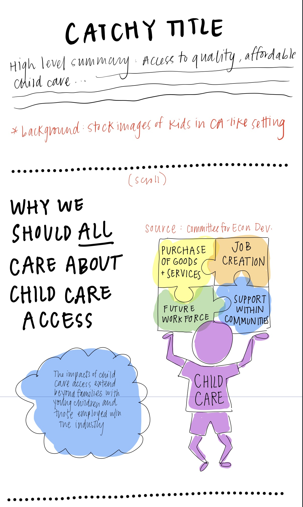

# Final Project Part I
Due February 28  
- [Return to main portfolio page](https://ejreece.github.io/ReecePortfolio/)
- [Final Project Part I](https://ejreece.github.io/ReecePortfolio/FinalProjectPart1.html)
- [Final Project Part II](https://ejreece.github.io/ReecePortfolio/FinalProjectPart2.html)
- [Final Project Part III](https://ejreece.github.io/ReecePortfolio/FinalProjectPart3.html)

## Project Outline

### High-level summary
Access to quality, affordable child care -- a necessity for most working families and a key ingredient for a viable workforce -- has become a luxury in California. Many families face both cost and accessibility challenges when trying to find quality child care. The Golden State needs to invest in strengthening its current fragile child care system. Investment efforts should focus on building capacity, over time, to increase the number of infants and toddlers that receive state-funded child care services.

### Project structure
With this project, I hope to illuminate the important role that child care access plays in our (specifically Californians') society, how the state's child care system is currently failing, and what can be done by both policymakers and those viewing my project in order to improve that system. I plan to achieve those goals by including the following major elements in my story: 

 - Why we should *all* care about child care access.
 - California's current system is not working: the cost & accessibility challenges of state-funded child care services.
 - What the state can do to improve the system.
 - Call to action: contact Governor Newsom and/or your local state representatives.

## Initial sketches

.png)
.png)
.png)
.png)
.png)
.png)

## The Data
I will rely on several different datasets for my final project. In searching for sources, I worked backwards from the "so what?" to get to the "what?". For example, going into this project I knew it would be important to explain why everyone -- not just parents or child care employees -- should care about child care access. The "so what?" in this case is that child care access impacts our entire economy. I then brainstormed what data (the "what?") would be most helpful in illustrating the impact that child care plays in California's economy. I settled on a few quantitative and qualitative data points/sources for this part of the story. 

Quantitative data includes the ratio of seniors to working-age adults, from 2010 to today as well as projections through 2060. I sourced this information from the [California Department of Finance](https://www.dof.ca.gov/Forecasting/Demographics/Projections/). I had to do a bit of data processing with this dataset, as the original version grouped the data by sex and 5 year age group. I also researched the percent of kids under 6 years old with all available parents participating in the labor force. This information came from [Kids Count Data Center](https://datacenter.kidscount.org/data/tables/5057-children-under-age-6-with-all-available-parents-in-the-labor-force?loc=1&loct=1#detailed/2/6/false/871,870,573,869,36,868,867,133,38,35/any/11472,11473) and did not require any processing. One of my two qualitative data points -- the link between child care and a state/local economy -- stemmed from [a report published by the Committee for Economic Development](https://www.ced.org/childcareimpact). The other involves a calculation of the ROI from investing in high-quality early childhood programs. That stat came from [this paper](https://www.nber.org/system/files/working_papers/w22993/w22993.pdf) published by Nobel Laureate Professor James Heckman from the University of Chicago.

After illustrating the link between child care and the economy, I want to highlight why California's current child care system needs to be improved. I chose data sources that focused on cost and accessibility. First, I sourced information regarding the annual cost of child care as a percent of annual median household income. Child care costs came from a [Child Care Aware of America report](https://www.childcareaware.org/wp-content/uploads/2020/09/2020StateFactSheets-UPDATE-AllStates-09242020.pdf?utm_campaign=Picking%20Up%20The%20Pieces&utm_source=52%20SFS%20%20PDF), while median household income is available via the [American Community Survey](https://www2.census.gov/programs-surveys/acs/summary_file/2019/data/1_year_geographic_comparison_tables/GCT1901.csv). Both of these datasets contain information for all 50 states. In addition to comparing California child care costs with that of other states, I want to compare the cost with other in-state programs that many Californians are familiar with. For this I turned to data regarding [University of California](https://www.ucop.edu/operating-budget/_files/fees/202021/2020-21_total_charges_by_campus.pdf) and [Cal State University](https://www2.calstate.edu/attend/paying-for-college/Documents/20-21-coa.pdf) annual tuition and fees, both readily available on each schools system's website. California's child care system also faces serious accessibility challenges, especially among low income families. For this point, I researched the percent of infants and toddlers born into a low-income household (and therefore eligible for subsidized child care). I was able to find the same statistic from 2016 and 2019 via the [California Health Care Foundation](https://www.chcf.org/collection/maternity-care-california-almanac/). Lastly, I found the portion of children served in California's early childhood education programs. This data came from the [Learning Policy Institute](https://healthyplacesindex.org/wp-content/uploads/2018/02/2017_understanding_ca_early_care_education_system.pdf) and is based on the U.S. Census Bureau's Population Survey. The data includes the number of eligible, enrolled and not enrolled toddlers and infants, grouped by a handful of age ranges.

I collected all of the aforementioned data in [this Google sheet](https://docs.google.com/spreadsheets/d/1pzjf7OrJH5477HYisvjivKc-lohD58QGjXnWbxZHZu4/edit#gid=0), which also contains all of the URLs I linked to above as well as a summary of each data point. 

## Method & medium
I plan to use Shorthand to incorporate the various data visualizations, diagrams and text I outlined in my initial sketches. I'll rely mostly on Tableau to create my data visualizations, although I might lean more on Flourish and Data Wrapper for the simple bar charts and line graphs. Tableau will be useful for the map of the U.S. depicting child care cost by state. I'll likely need to use powerpoint or Google drawings for more conceptual visualizations, such as the illustration showing the key role that child care plays in a state/local economy. 
